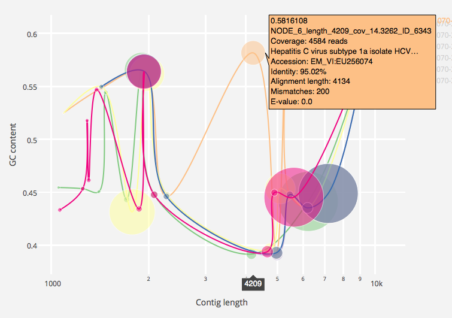

# Venorm  

Venorm is a pipeline for assembling deep paired-end Illumina reads from populations of specific viruses. Coverage normalisation can dramatically improve assemblies of HIV and HCV, but should be parameterised on a per-sample basis for best results. Venorm accepts paired Illumina reads and lists of normalisation target coverage `c` and normalisation `k` values. Adapter sequences are trimmed with Trimmomatic and optionally quality trimmed with the `--qual-trim` flag, and then normalised in parallel using Khmer's `normalize-by-median.py` for each combination of `c` and `k`. Each set of reads is subsequently assembled with SPAdes. Assemblies may be classified with either k-mer based LCA or BLAST and plotted as bubbles. The `--lca` flag uses the One Codex real time API and requires an API key to be passed with `--one-codex-api-key <key>`. Command line options may be viewed by running `venorm --help`
  
  
  
Feel free to get in touch via `b at bede dot im` or [Twitter](https://twitter.com/beconstant) 

## Dependencies  
Tested on OS X. I'm informed it also runs on Ubuntu with dependencies installed via `apt-get` and Linuxbrew  
Requires: Java, **Python 3.5**, SPAdes, Bowtie2, Samtools, VCFtools, BCFtools, SeqTK, Argh, Biopython, Khmer, Pandas, Plotly  
Trimmomatic (jar file) is bundled inside `res/`  

### Mac OS X
Using Homebrew and pip is the easiest approach. I strongly recommend creating a new virtualenv to manage the Python dependencies  
- `brew tap homebrew/homebrew-science`
- `brew install python3 spades bowtie2 samtools vcftools bcftools seqtk`
- `pip3 install argh numpy biopython khmer pandas plotly`  

## Usage
Unzip `venorm.py` and the `res/` directory  
Ensure dependencies are discoverable inside $PATH  
N.B. Specify reads using absolute paths  
Having issues? Set log level to `INFO` for verbose output and send me an email  
  
```
$ ./venorm.py help
usage: venorm.py [-h] [-f FWD_FQ] [-r REV_FQ] [-q] [--blast] [-l]
                 [--norm-c-list NORM_C_LIST] [--norm-k-list NORM_K_LIST]
                 [-a ASM_K_LIST] [--no-norm]
                 [--one-codex-api-key ONECODEX_API_KEY] [--blast-db BLAST_DB]
                 [--blast-max-seqs BLAST_MAX_SEQS] [-m MIN_LEN]
                 [--out-prefix OUT_PREFIX] [-t THREADS]

optional arguments:
  -h, --help            show this help message and exit
  -f FWD_FQ, --fwd-fq FWD_FQ
                        -
  -r REV_FQ, --rev-fq REV_FQ
                        -
  -q, --qual-trim       False
  --blast               False
  -l, --lca             False
  --norm-c-list NORM_C_LIST
                        -
  --norm-k-list NORM_K_LIST
                        -
  -a ASM_K_LIST, --asm-k-list ASM_K_LIST
                        -
  --no-norm             False
  --one-codex-api-key ONECODEX_API_KEY
                        False
  --blast-db BLAST_DB   'em_rel'
  --blast-max-seqs BLAST_MAX_SEQS
                        5
  -m MIN_LEN, --min-len MIN_LEN
                        500
  --out-prefix OUT_PREFIX
                        'venorm'
  -t THREADS, --threads THREADS
                        4
```

Run sparNA without quality trimming (just adapter trimming) and using default SPAdes k-mers  
```
./venorm.py --lca --fwd-fq /Users/Bede/oxgl/1.f.fastq --rev-fq /Users/Bede/oxgl/1.r.fastq --norm-c-list 1,5,20,100 --norm-k-list 21,25,31 --out-prefix 1_no_qtrim-norm_c1c5c10c20c100k21k25k31 --threads 6  
```
  
Run sparNA with PHRED Q20 sliding window 3' trimming and using default SPAdes k-mers and additionally perform assembly without prior normalisation  

```
./venorm.py --lca --qual-trim --no-norm--fwd-fq /Users/Bede/oxgl/1.f.fastq --rev-fq /Users/Bede/oxgl/1.r.fastq --norm-c-list 1,5,20,100 --norm-k-list 21,25,31 --out-prefix 1_qtrim-norm_c0c1c5c10c20c100k0k21k25k31  
```

Sample run:
```
$ ./venorm.py \
	--lca \
	--no-norm \
	--fwd-fq tests/in/060-660_r1_Cap1_F.fastq \
	--rev-fq tests/in/060-660_r1_Cap1_R.fastq \
	--norm-c-list 1,10,100 \
	--norm-k-list 21,31 \
	--out-prefix tests/out/tst_no_qtrim-norm_c1c10k21k25_oc \
	--one-codex-api-key <redacted>
	--threads 6

Importing reads...
	Done
Trimming...
	Done
Normalising...
	Normalising norm_c=1, norm_k=21
	Normalising norm_c=10, norm_k=21
	Normalising norm_c=100, norm_k=21
	Normalising norm_c=1, norm_k=31
	Normalising norm_c=10, norm_k=31
	Normalising norm_c=100, norm_k=31
	All done
Assembling...
	Assembling without prior normalisation
	Assembling norm_c=1, norm_k=21, asm_k=0
	Assembling norm_c=10, norm_k=21, asm_k=0
	Assembling norm_c=100, norm_k=21, asm_k=0
	Assembling norm_c=1, norm_k=31, asm_k=0
	Assembling norm_c=10, norm_k=31, asm_k=0
	Assembling norm_c=100, norm_k=31, asm_k=0
	All done
Aligning to assemblies... (Bowtie2)
060-660_r1_Cap1_F.no_norm.asm_k 0
	Done (bowtie2-build)
	Done (bowtie2)
	Done (grep)
	Done (samtools)
	Done (samtools)
	Done (samtools)
060-660_r1_Cap1_F.norm_k21c1.asm_k 0
	Done (bowtie2-build)
	Done (bowtie2)
	Done (grep)
	Done (samtools)
	Done (samtools)
	Done (samtools)
060-660_r1_Cap1_F.norm_k21c10.asm_k 0
	Done (bowtie2-build)
	Done (bowtie2)
	Done (grep)
	Done (samtools)
	Done (samtools)
	Done (samtools)
060-660_r1_Cap1_F.norm_k21c100.asm_k 0
	Done (bowtie2-build)
	Done (bowtie2)
	Done (grep)
	Done (samtools)
	Done (samtools)
	Done (samtools)
060-660_r1_Cap1_F.norm_k31c1.asm_k 0
	Done (bowtie2-build)
	Done (bowtie2)
	Done (grep)
	Done (samtools)
	Done (samtools)
	Done (samtools)
060-660_r1_Cap1_F.norm_k31c10.asm_k 0
	Done (bowtie2-build)
	Done (bowtie2)
	Done (grep)
	Done (samtools)
	Done (samtools)
	Done (samtools)
060-660_r1_Cap1_F.norm_k31c100.asm_k 0
	Done (bowtie2-build)
	Done (bowtie2)
	Done (grep)
	Done (samtools)
	Done (samtools)
	Done (samtools)
Fetching LCA taxonomic assignments... (requires network access)
	Assembly 060-660_r1_Cap1_F.no_norm.asm_k
	Assembly 060-660_r1_Cap1_F.norm_k21c1.asm_k
	Assembly 060-660_r1_Cap1_F.norm_k21c10.asm_k
	Assembly 060-660_r1_Cap1_F.norm_k21c100.asm_k
	Assembly 060-660_r1_Cap1_F.norm_k31c1.asm_k
	Assembly 060-660_r1_Cap1_F.norm_k31c10.asm_k
	Assembly 060-660_r1_Cap1_F.norm_k31c100.asm_k
wall_time	41.01566505432129
chart_url	file:///Users/Bede/Research/Tools/venorm/tests/out/tst_no_qtrim-norm_c1c10k21k25_oc_060-660_r1_Cap1_F/plot.html
$

```

# Issues

- Running `./venorm.py` without arguments causes crash
- If you experience issues with importing, first try using absolute paths
- Does not accept interleaved reads
- Uses 4 x 100MB hash tables for normalisation, which may be insufficient for some large datasets